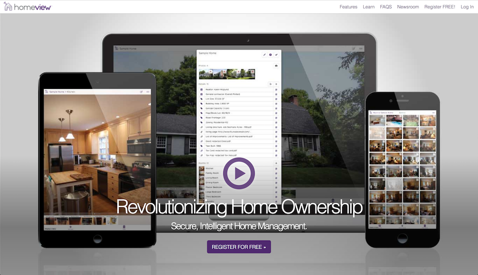
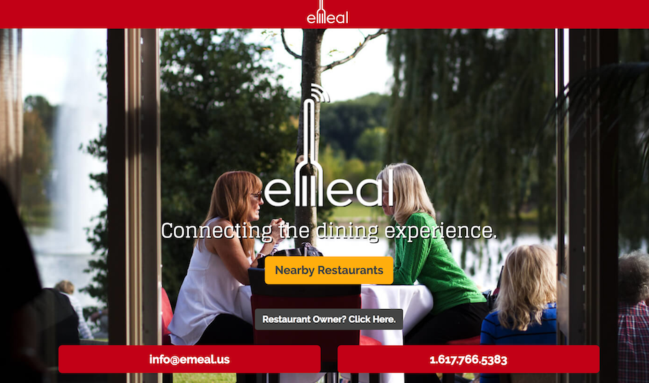
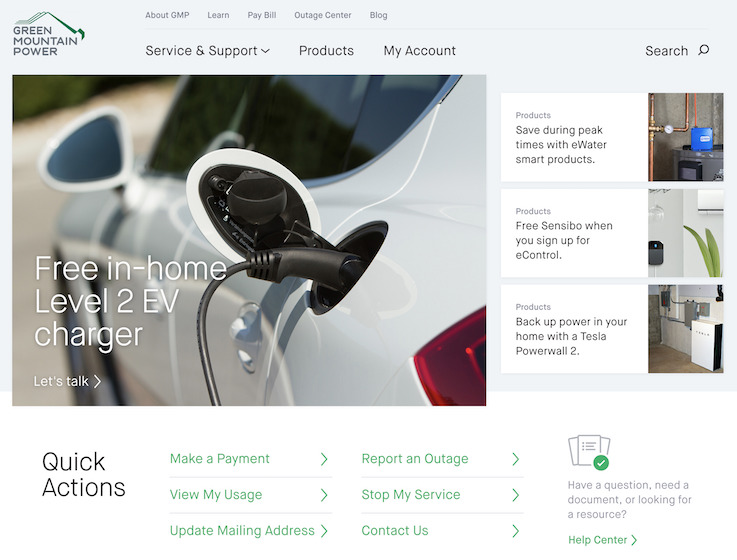
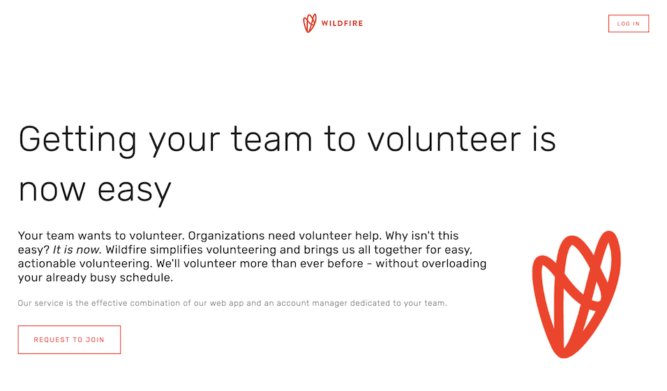
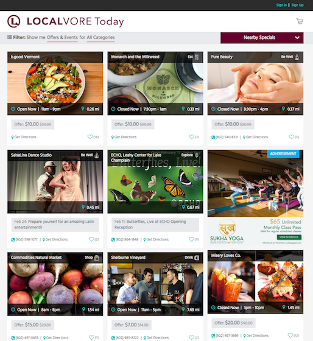

# About Me
[Resume](assets/downloads/KeenanVillaniHolland.pdf) | [GitHub](http://github.com/kvillaniholland) | [LinkedIn](https://www.linkedin.com/in/keenan-villani-holland-a8381a69) | [Email](mailto:keenan@kvillaniholland.codes)

I'm a full-stack web developer with experience building and deploying web apps from scratch, maintaining and improving existing code, as well as working within various content management systems. I care about keeping my code elegant, clean and maintainable. I'm always happy to learn new languages, frameworks and tools.

----------------------

# Portfolio
- 
  - HomeView
  - **Product:** A web app and corresponding iOS app for homeowners to keep track of their properties.
  - **Project:** A complete rewrite of the frontend, consuming a pre-existing API.
  - **Process:** The rewrite used **React** and **Redux**, and was hosted and deployed by the client. The iOS app was built using **Cordova**.
  - **Responsibilities:** As a developer, I was responsible for understanding the functionality of the existing app, and replicating it in the rewrite. I also helped create documentation for the existing API, which was undocumented at the start of the project.
- 
  - eMeal
  - **Product**: A web app for ordering food at restaurants.
  - **Project:** A single page app with point of sale system integration for browsing restaurants and menus, placing orders and splitting bills.
  - **Process:** The API was built with **Laravel** and used **Omnivore.io** for POS integration. The client was built with **Backbone.js** and **LESS**. The app was hosted on **AWS**, using **ECS** and **RDS**.
  - **Responsibilities:** As lead developer and project anchor, I was responsible for developing new features, maintaining the codebase and coordinating with the client, as well as with Omnivore and occasionally with point of sale companies to resolve issues with the point of sale integration.
- 
  - Green Mountain Power
  - **Product:** A website built for a local power company, including several interactive maps, and a sales section.
  - **Project:** A highly customized **Wordpress** install.
  - **Process:** The site included a highly customized Wordpress theme, several custom Wordpress plugins, extensive use of the  **Advanced Custom Fields** plugin, and custom **JavaScript**. The site was hosted with **WPEngine**.
  - **Responsibilities:** As the lead developer, I was responsible for developing new features and implementing new designs. I also modernized the build process and added support for **ES6**. As project anchor, I was responsible for working with the client on a daily basis to understand project requirements, deliver code and provide technical support.
- 
  - WildFire
  - **Product:** A platform for connecting users with volunteer opportunities.
  - **Project:** An API, to be consumed a single page app (developed separately).
  - **Process:** The API was built with **Node**, using **Express.js**, and used **AWS DynamoDB** for a datastore. It was hosted on **AWS ECS**.
  - **Responsibilites:** As freelance developer, I was responsible for developing the entire API, as well as working with the client to determine requirements, deliver work and address bugs.
- 
  - Localvore  
  - **Product:** A web app for finding deals at local businesses.
  - **Project:** A single page app for browsing and purchasing coupon deals, with an administrator panel to create and manage deals.
  - **Process:** The API was built with **Laravel** and **MySQL**. The client was built with **Backbone.js**. The app was hosted on **AWS**, using **ECS** and **RDS**.
  - **Responsibilities:** As a member of the development team, I was responsible for building new features and maintaining existing code, as well as reviewing code before it was deployed. As project anchor, I helped coordinate with the project manager, the client and the rest of the developers to plan and deliver work.
