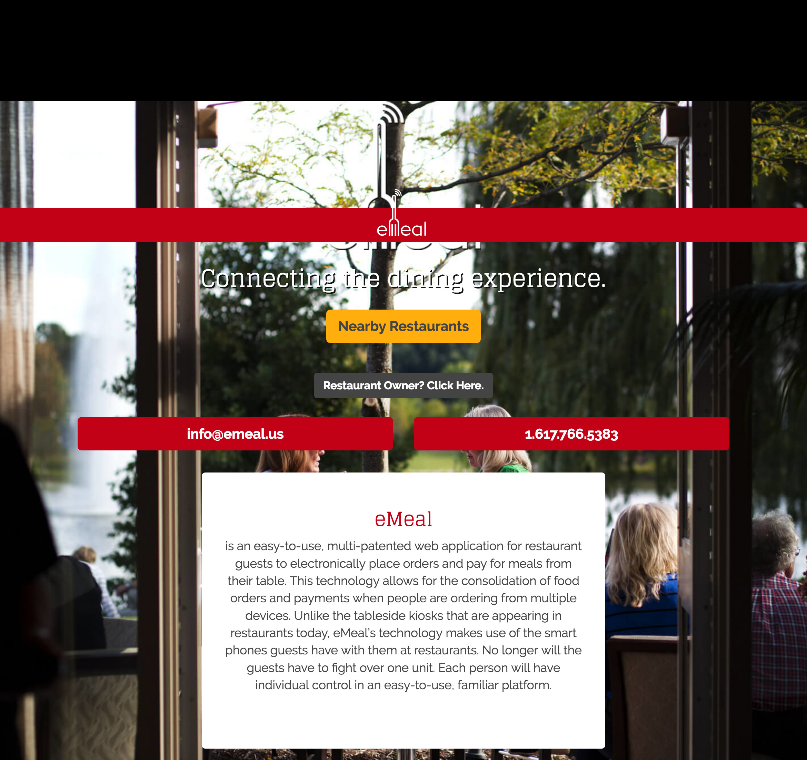
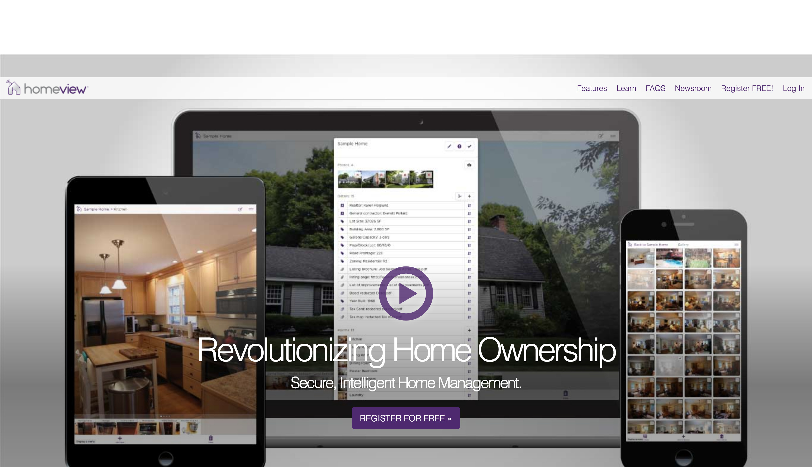
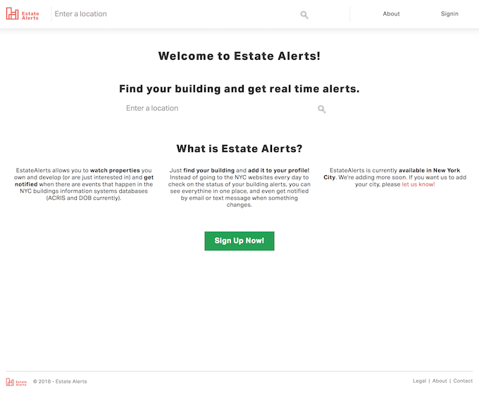
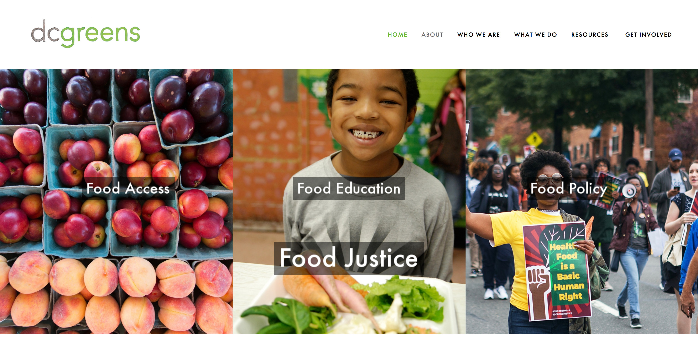

# Portfolio
- 
  - Localvore  
  - Built and maintained a site redesign.
  - Single page app using **Laravel** for the API and **Backbone.js** for the frontend.
  - Helped coordinate development and delivery as project anchor.
- 
  - Green Mountain Power
  - Maintained and developed a custom **Wordpress** theme, including custom plugin development
   and extensive use of **Advanced Custom Fields**.
  - Refactored legacy build system in order to streamline it an provide support for **ES6**.
  - Implemented designs by and external design team.
  - Helped coordinate development, delivery and project planning as project anchor.
- 
  - eMeal
  - Developed a single page app using **Laravel** for the APP and **Backbone.js** for the frontend.
  - Built integration with **Omnivore.io** to connect the eMeal to POS systems in restaurants.
- 
  - HomeView
  - Built using **React** and **Redux**.
  - Assisted with complete rewrite of the app, using an existing API.
  - Brought the rewrite to feature parity with the legacy app.
- 
  - EstateAlerts
  - Assisted with various bugs and improvements on both the backend (**Laravel**) and front-end (**React**, **Redux**).
  - Extensive debugging of the automated alert system built with **Laravel** and **AWS** (using **SNS** and **Lambda**).
- 
  - DC Greens
  - Helped build an admin dashboard using **React** and **Redux**.
  - Helped maintain the API built with **Laravel**.
  - Worked on the Android app, built with **Cordova**.
- 
  - WildFire
  - Built the first version of the API using **Node**, **Express** and **AWS DynamoDB**.

# Skills
These are the tools I'm most familiar with, but learning new ones isn't an issue!

**Amazon Web Services** (Elastic Compute Cloud, EC2 Container Service, RDS, Lambda, Simple Email Service, API Gateway), **Docker**, **Git**, **PHP** (Laravel, Dingo), **JavaScript** (Node, React, Redux, Angular), **Wordpress**, **Python**, **MySQL**, **Java**, **Ruby**, **HTML**, **CSS** (Less, Sass)

# Resume
[Download](assets/downloads/KeenanVillaniHolland.pdf)
