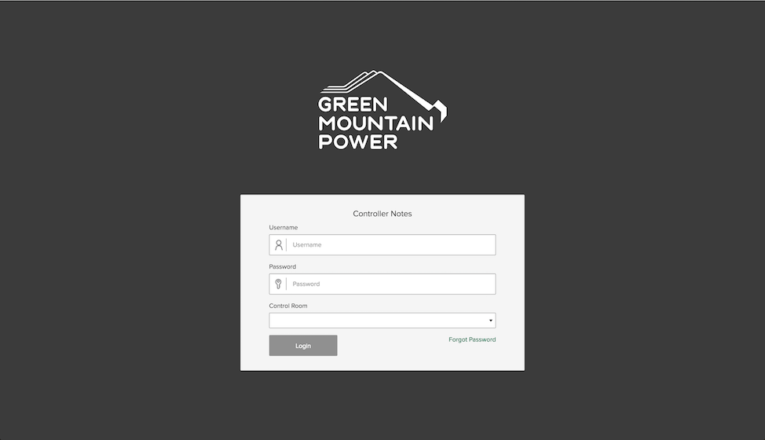

# About Me
[Resume](assets/downloads/KeenanVillaniHolland.pdf) | [GitHub](http://github.com/kvillaniholland) | [LinkedIn](https://www.linkedin.com/in/keenan-villani-holland-a8381a69) | [Email](mailto:kvillaniholland@gmail.com)

I'm a web developer currently living in Tokyo. I care about keeping my code elegant, clean and maintainable. I have experience building and deploying web apps from scratch as well as working within various content management systems. I love learning to use new languages, frameworks and tools.

# Portfolio
- 
  - Localvore  
  - Built and maintained a single page app using **Laravel** for the API and **Backbone.js** for the frontend.
  - Helped coordinate development and delivery as project anchor.
- 
  - Green Mountain Power
  - Maintained and developed a custom **Wordpress** theme, including custom plugin development
   and extensive use of **Advanced Custom Fields**.
  - Refactored legacy build system in order to streamline it, and provide support for **ES6**.
  - Implemented designs by and external design team.
  - Helped coordinate development, delivery and project planning as project anchor.
- 
  - eMeal
  - Developed a single page app using **Laravel** for the APP and **Backbone.js** for the frontend.
  - Built integration with **Omnivore.io** to connect the eMeal to POS systems in restaurants.
- 
  - HomeView
  - Assisted with a complete rewrite of the frontend using **React** and **Redux**.
  - Brought the rewrite to feature parity with the legacy app.
  - Developed a mobile app with **Cordova**.
- 
  - Green Mountain Power Controller
  - Maintained and extended internal tools for Green Mountain Power.
  - Built with **Angular**.
- 
  - EstateAlerts
  - Assisted with various bugs and improvements on both the backend (**Laravel**) and front-end (**React**, **Redux**).
  - Extensive debugging of the automated alert system built with **Laravel** and **AWS** (using **SNS** and **Lambda**).
- 
  - DC Greens
  - Helped build an admin dashboard using **React** and **Redux**.
  - Helped maintain the API built with **Laravel**.
  - Worked on the Android app, built with **Cordova**.
- 
  - WildFire
  - Built the first version of the API using **Node**, **Express** and **AWS DynamoDB**.
